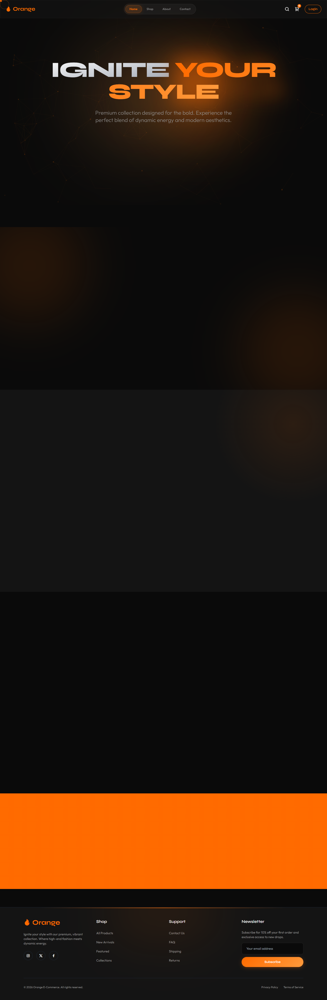
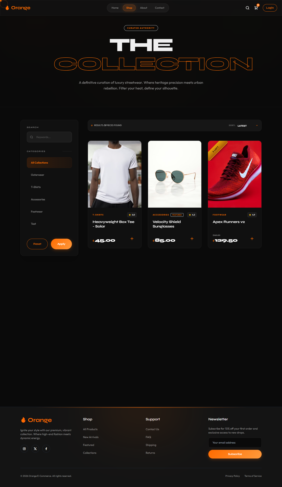
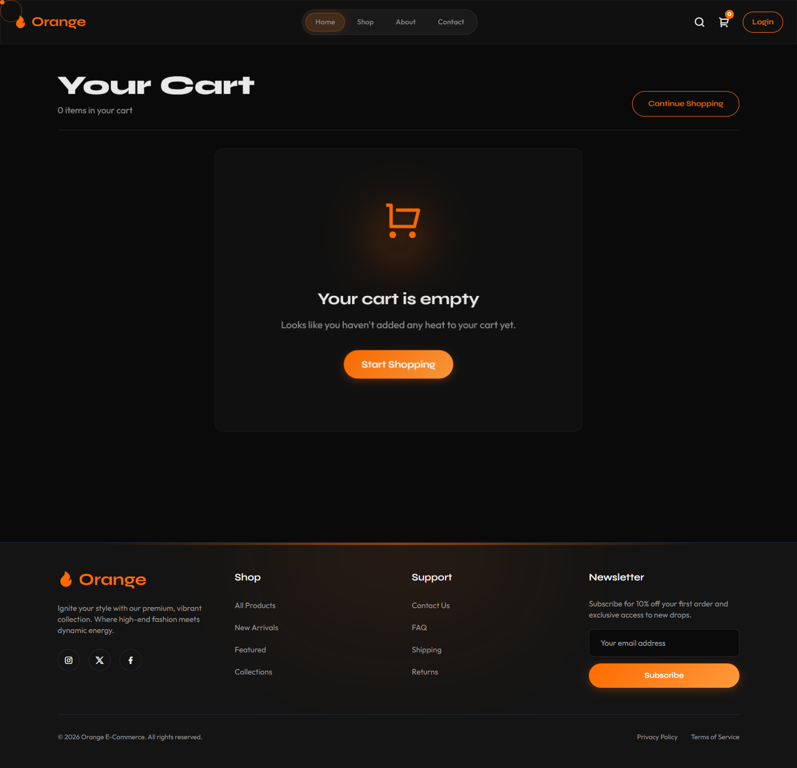
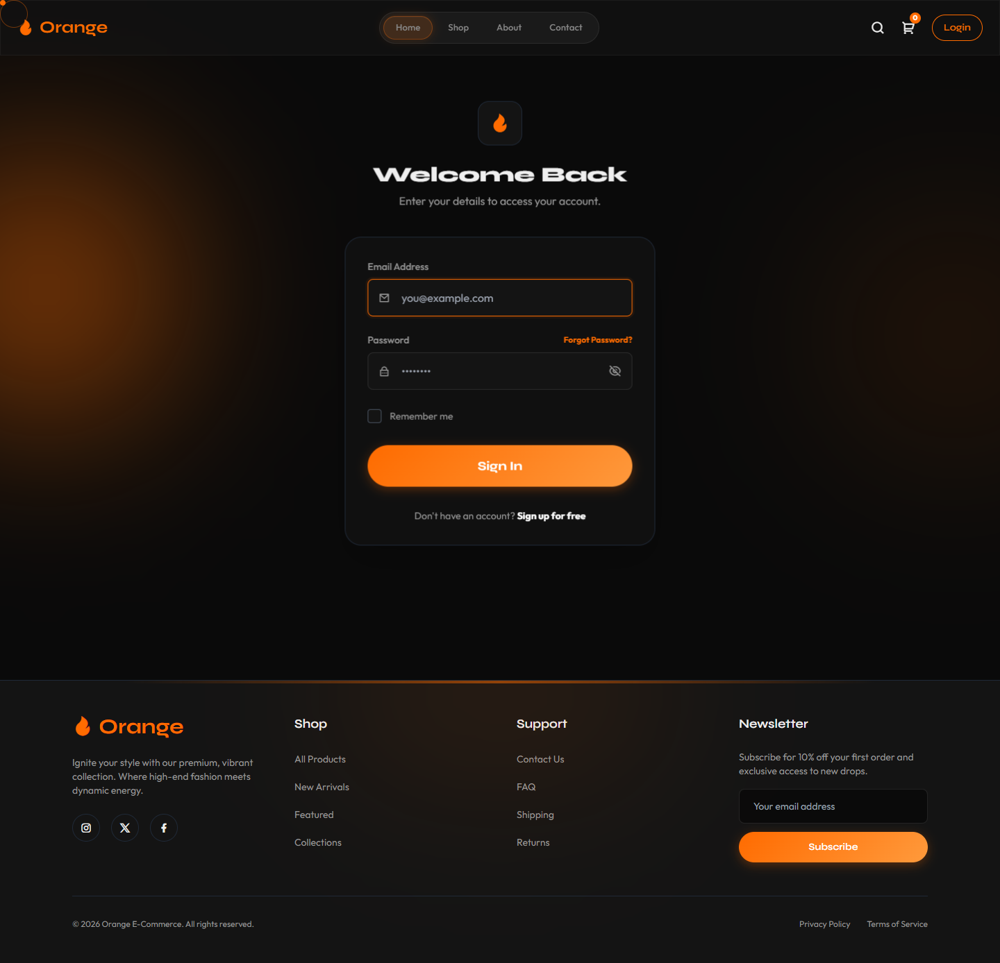

# Orange Laravel E-Commerce

Orange is a robust, dynamic e-commerce application built with Laravel. It features a modern, responsive user interface with dynamic animations, guest and authenticated cart merging, and seamless checkout flows.

## 📸 Screenshots

### Home Page


### Shop Page


### Cart


### Contact


### Login


## 🚀 Key Features
- **Frontend**: Clean, modern UI using Tailwind CSS, GSAP for animations, and Alpine.js.
- **Shopping Cart**: Guest caching and automatic database merging upon login.
- **Admin Dashboard**: Full CRUD for products, categories, coupons, and orders.
- **Authentication**: Laravel Breeze scaffolding with robust role management.

## 🛠️ Local Development Setup

### Prerequisites
- PHP 8.2+
- Composer
- Node.js & npm
- PostgreSQL (or SQLite/MySQL)

### Installation

1. **Clone the repository**
   ```bash
   git clone https://github.com/Tilak9737/Orange.git
   cd Orange
   ```

2. **Install PHP dependencies**
   ```bash
   composer install
   ```

3. **Install Node dependencies & build assets**
   ```bash
   npm install
   npm run build
   ```

4. **Environment Setup**
   ```bash
   cp .env.example .env
   php artisan key:generate
   ```
   *Configure your database settings in the `.env` file.*

5. **Run Migrations & Seeders**
   ```bash
   php artisan migrate --seed
   ```

6. **Serve the Application**
   ```bash
   php artisan serve
   ```
   Visit `http://localhost:8000`.

---

## 🌩️ Deployment Guide (Render & Neon PostgreSQL)

When deploying this application (specifically to Render using a connection-pooled database like Neon), follow these critical best practices to avoid common issues:

### 1. Avoiding the "Port Detection Loop"
Render's health checks fail if your application only binds to IPv6 (`::1`) or the wrong port.
- **Fix**: Use `deploy.sh` to dynamically force Apache to bind to IPv4 on Render's `$PORT`:
  ```bash
  sed -ri "s/^Listen[[:space:]]+80$/Listen 0.0.0.0:${PORT}/" /etc/apache2/ports.conf
  ```

### 2. Fixing Mixed Content (HTTP vs HTTPS)
Laravel sits behind Render's proxy and might generate insecure `http://` assets.
- **Fix**: 
  - Set `APP_URL=https://your-app.onrender.com` in Render Environment Variables.
  - In `bootstrap/app.php`, trust all proxies: `$middleware->trustProxies(at: '*');`
  - In `AppServiceProvider.php`, force the HTTPS scheme:
    ```php
    if (app()->environment('production')) {
        \Illuminate\Support\Facades\URL::forceScheme('https');
    }
    ```

### 3. Resolving 500 Errors on Failed Login (Transaction Aborts)
When using a pooled database (like Neon) with Laravel's `database` cache driver, rate-limiting locks can cause **Postgres 25P02 Transaction Abort** errors on failed logins.
- **Fix**: Use the filesytem for cache and cookies for sessions on Render.
  - Set `CACHE_STORE=file`
  - Set `SESSION_DRIVER=cookie`

### 4. Neon PostgreSQL SNI Errors
If using older `libpq` versions locally, Neon might reject connections without Endpoint IDs.
- **Local Fix**: Prepend the endpoint ID to your password: `DB_PASSWORD=endpoint=ep-id$password`.
- **Render Fix**: Render supports SNI natively. Use the plain password and set `DB_SSLMODE=require`.
